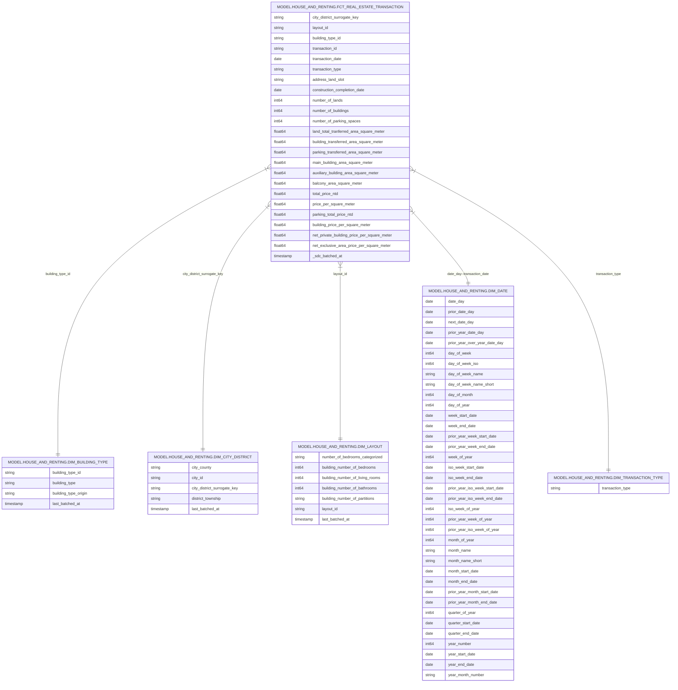

## 1. Project Overview:

### Goal and Purpose:
The primary goal of this project is to showcase my technical proficiency in data engineering and business intelligence (BI), with a particular focus on modern ELT (Extract, Load, Transform) practices, dimensional modeling, and the creation of insightful visualizations. This project serves as a practical demonstration of my ability to deliver an end-to-end analytics solution.

### Scope:
The project includes the following key activities:
+ Web Scrapping: Scrapping data from [Taiwan Real Estate Transaction Price Registration System](https://plvr.land.moi.gov.tw/DownloadOpenData) 
+ Extract and Load: Stored Scraped data in structured storage.
+ Data Transformation: Cleaning, modeling, and aggregating the data using ELT workflows to prepare it for analytical querying.
+ Semantic Dataset: Designing a clear, easy-to-query dimensional model and a semantic (metrics) layer to facilitate meaningful analytics.
+ Dashboard Design and Implementation: Creating interactive dashboards guided by simulated stakeholder interactions (via ChatGPT), ensuring relevance, clarity, and alignment with realistic business requirements and user scenarios.

## 2. Data Sources and Infrastructure

### Data Sources
+ [city_code.csv](https://github.com/josean-zorro/tw_real_estate/blob/main/transform/seeds/taiwan_city_code.csv)
	+ Manually collected through google search and wikipedia
+  [Taiwan Real Estate Transaction Price Registration System](https://plvr.land.moi.gov.tw/DownloadOpenData) 
	+ land, building, and parking space transactions
	+ Pre-sale house (TBD)

### Tools and Technologies

- **Programming Language:**   

- **Cloud Storage:**   

- **Data Warehouse:**  

- **Extract and Load:**  

- **Transformation:**  

- **CI/CD:**    

- **Semantic Layer (Data Mart):**  

- **Visualization:**  

### Infrastructure Overview

Web scraping → Raw data storage in Google Cloud Storage → Data ingestion and loading into BigQuery using Meltano → Data transformation and modeling in BigQuery using dbt → Semantic dataset creation in Power BI → Interactive dashboards and analytics in Power BI.

## 3. Data Models & Transformations

### Data Mart & Data Modeling Description:
This project uses a dimensional modeling approach in data marts optimized for analytical queries. The schema shown as the follows:

### Transformation Logic:

Please refer to [dbt transformation logic](https://gallopgoose.com/tw_real_estate/#!/overview)

## 4. Data Quality & Testing

### Tests & Validation

Data quality is maintained through automated tests defined within dbt models, including:

#### Source Layer:
+ **Uniqueness tests**: Ensuring transaction IDs are unique.
+  **Non-null checks**: Ensuring critical fields (e.g., transaction dates, price values) contain no null values.
+ Pattern Checks: Ensuring critical fields (e.g., date, district) have the correct pattern

#### Data Mart Layer:
- **Uniqueness tests**: Ensuring transaction IDs are unique.
- **Non-null checks**: Ensuring critical fields (e.g., transaction dates, price values) contain no null values.
- **Referential integrity checks**: Confirming dimension keys in fact tables have valid dimension records.

These tests run automatically during each dbt deployment as part of CI/CD pipelines (GitHub Actions), ensuring data reliability and preventing issues from reaching the BI layer.

## 5. Semantic Dataset, BI & Visualization

### Semantic Dataset & Setup

A semantic model was developed within **Power BI**, connected directly to the well-transformed tables in **Google BigQuery**. This model defines key measures, fact, and dimension tables, and their relationships—enabling self-service analytics and consistent reporting logic across all visuals.

**Key features include:**
- Galaxy schema design with clearly defined fact and dimension tables.
- Centralized definitions for KPIs such as average price, price per square meter, and transaction counts.
- Built-in hierarchies for drill-downs (e.g., region → district).

**Notes:**
- All data transformations are performed using **dbt**.
- Minimal business logic is handled in Power BI’s **Power Query**, keeping the semantic layer clean and focused.
- - **Data refresh schedule**: Dashboards are refreshed regularly on the first Monday after the 1st, 11th, and 21st of each month. This aligns with the update frequency of the [Taiwan Real Estate Transaction Price Registration System](https://plvr.land.moi.gov.tw/DownloadOpenData) and considers limitations of the **Power BI Free version** (which lacks automatic scheduled refresh on cloud datasets).

### BI Tool & Setup

The dashboards were built using **Power BI** and connected directly to the semantic dataset, ensuring that KPIs across different reports / dashboards share with the same definitions.

DAG(TBD)

### Dashboard Catalog

+ [[Market Analysis for Investor]] (Click to view the dashboard)

- Market Analysis for Homebuyer (TBD)

## 6. Future Enhancement

+ A better schema design for dimension, especially building type and transaction types
+ Ingest pre-sales house data
+ Ingest rental Data
+ Martet Analysis for HomeBuyer
